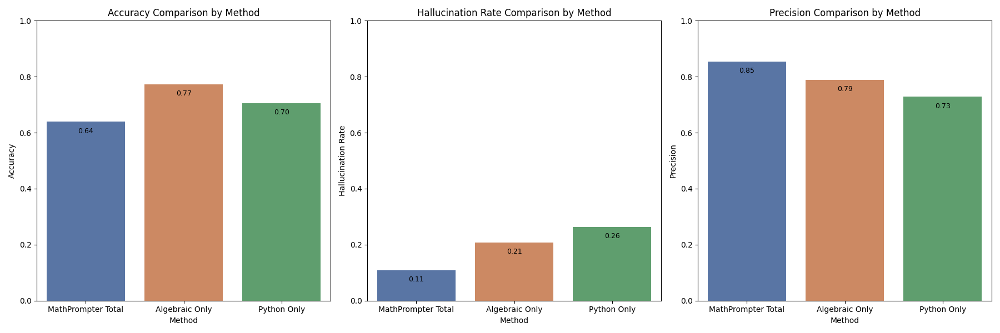

# MathPrompter Implementation

This repository contains an implementation of the techniques presented in the research paper ["MathPrompter: Mathematical Reasoning Using Large Language Models"](https://arxiv.org/abs/2303.05398) by Shima Imani, Liang Du, and Harsh Shrivastava from Microsoft Research. The implementation aims to replicate the improved performance of Large Language Models (LLMs) in arithmetic reasoning tasks using the MathPrompter technique.

## Disclaimer

This project is an independent implementation of the techniques described in the ["MathPrompter: Mathematical Reasoning Using Large Language Models"](https://arxiv.org/abs/2303.05398) paper by Microsoft researchers. It is not officially associated with the original authors or Microsoft. For the official and original research, please refer to the cited paper.

## Custom Changes from the Original Paper

### Including units in the Generation of Algebraic Template

The original paper omits the units (i.e. "$50" is replaced by A). I believe that units are important for reasoning (assume the question is "What is 1m divided by 20cm?"). Therefore, I will leave the units as part of the question.

### Custom Few-Shot Prompts

We have adopted customized few-shot prompts instead of those proposed in the original paper. These prompts have shown improved performance and consistency on platforms like Google Gemini Pro and Azure OpenAI GPT-3.5-Turbo.

Example prompt for arithmetic expression generation:

```plaintext
<Question>: John has A apples. He gives B apples to his friend. How many apples does John have left?
Answer = A - B
...
<Question>: {question}
```

However, you should experiment with different prompts and test which prompts work best for your specific LLM API, as effectiveness can vary depending on the model.

## Evaluating Performance on the SVAMP Dataset

For evaluating our implementation, we benchmarked it on the [SVAMP](https://github.com/arkilpatel/SVAMP/tree/main) dataset (which contains 1000 math word problems). For the detailed evaluation process, please look at the README in the evaluation folder.

To manage costs effectively, each prompt was processed exactly once, an approach we term as `self_consistency=1`. Given that each problem is addressed in a single model run, we set the `temperature` parameter to 0. This ensures that the model response is deterministic, providing the most probable and stable output for each input without the variability that higher temperature settings would introduce.

The evaluation of MathPrompter on the SVAMP dataset achieved an accuracy of **63.9%**.



The evaluation of MathPrompter using the SVAMP dataset reveals distinct strengths across different methodologies. The comprehensive approach (MathPrompter Total) demonstrates respectable accuracy (63.9%) with a low hallucination rate (10.9%), indicating reliable problem-solving capabilities. Specialized methods such as Algebraic Only and Python Only exhibit higher accuracy rates of 77.3% and 70.5% respectively but also show increased hallucination rates. This points to their heightened sensitivity and potential to overfit specific problem types.

For a comparative analysis of how our results hold up against current state-of-the-art methodologies, you can visit the [PaperWithCode Leaderboard for the SVAMP benchmark](https://paperswithcode.com/sota/math-word-problem-solving-on-svamp).

Notably, when considering only models that operate without the use of additional training data, our implementation ranks 4th.

## Installation

Clone this repository and navigate into the project directory. Install the required dependencies:

```bash
git clone https://github.com/RamonKaspar/MathPrompter.git
cd MathPrompter
pip install -r requirements.txt
```

## Usage

To use the MathPrompter, run the main script or import functions directly into your Python projects:

```bash
python main.py
```

Detailed documentation on function usage and parameters can be found in the docstrings within the code.

For instructions on setting up a connection to an LLM API, please consult the `README.md` file located in the `llm_inference` directory.

## Future Work and Enhancements

While the current implementation of MathPrompter provides a foundational approach to solving algebraic questions, there are several enhancements and optimizations that can further improve its performance and functionality:

1. **Parallelization of API Calls**:

   - Implement parallel processing to handle API calls more efficiently. This could significantly speed up computations by making simultaneous requests.

2. **Probabilistic Results Implementation**:

   - Refine the result evaluation mechanism to return a probability along with each result. Currently, a consensus needs to be reached across all iterations for a result to be returned.

3. **Use Different Model Parameters**:
   - We typically prompt the LLM $N$ times (default is $N=5$) to generate algebraic expressions and Python code. By varying model parameters such as temperature and top_p in future iterations, we could potentially obtain more diverse answers.

## Citing the Original Work

This implementation is based on the following work:

```bibtex
@article{imani2023mathprompter,
  title={MathPrompter: Mathematical Reasoning Using Large Language Models},
  author={Imani, Shima and Du, Liang and Shrivastava, Harsh},
  journal={arXiv preprint arXiv:2303.05398},
  year={2023}
}
```

For more detail and to read the paper, you can access it [here](https://arxiv.org/abs/2303.05398).

## License

This implementation is provided under the MIT License, which allows for commercial use, modification, distribution, and private use. See the LICENSE file for full details.
